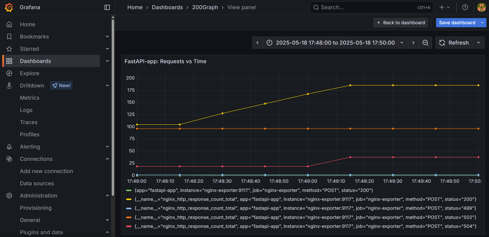

# Movie Recommendation API

[](https://opensource.org/licenses/MIT)
[](https://github.com/Jagapathi-G/movie-recommender-api/stargazers)
[](https://www.docker.com/)
[](https://www.python.org/)
[](https://fastapi.tiangolo.com/)
[](https://prometheus.io/)
[](https://grafana.com/)
[](https://github.com/Jagapathi-G/movie-recommender-api/commits/main)

A non-ML-based movie recommendation API built with FastAPI, SQLite, and the MovieLens 1M dataset. The API provides movie recommendations based on genre and minimum rating, with a scalable architecture using Docker, Nginx for load balancing, and Prometheus/Grafana for monitoring. Deployment is automated using GitHub Actions.

## Features
- **Recommendation Endpoint**: Get movie recommendations by genre and minimum rating (`POST /recommend`).
- **Scalable Architecture**: Runs multiple FastAPI instances in Docker containers with Nginx load balancing.
- **External Metrics Collection**: Uses Nginx logs for monitoring without modifying the app.
- **Monitoring**: Prometheus and Grafana for request metrics and visualizations.
- **Automated Deployment**: Uses GitHub Actions for CI/CD to build, test, and deploy to a remote server.
- **Production-Ready**: Designed for scalability with potential Kubernetes deployment.

## Tech Stack
- **Backend**: FastAPI with `uvicorn` (ASGI server)
- **Database**: SQLite (`movies.db`) with MovieLens 1M dataset
- **Containerization**: Docker and Docker Compose
- **Reverse Proxy**: Nginx (load balancing and logging)
- **Monitoring**: Prometheus (metrics scraping), Grafana (dashboards), Prometheus Nginx Log Exporter
- **CI/CD**: GitHub Actions

## Prerequisites
- **Docker** and **Docker Compose** (for local testing or server deployment)
- **GitHub Account** (for automated deployment)
- **Remote or Local Server** (e.g., AWS EC2 with Docker installed for Remote deployment)
- **ngrok** (optional, for exposing local services)

## Setup Instructions

### 1. Clone the Repository
```bash
git clone https://github.com/Jagapathi-G/movie-recommender-api.git
cd movie-recommender-api
```

#### Local Testing (Optional)
If you want to test locally before deployment:
```bash
docker compose up -d --build --scale app=3
cd monitoring
docker compose up -d
```
- Access the API at `http://127.0.0.1:8000`.
- Prometheus: `http://127.0.0.1:9090`
- Grafana: `http://127.0.0.1:3000` (default credentials: `admin/admin`)


## Usage

### API Endpoint
- **Endpoint**: `POST /recommend`
- **Parameters**:
  - `genre` (string): Movie genre (e.g., "Comedy")
  - `min_rating` (float, optional): Minimum average rating (default: 4.0)
  - `n` (int, optional): Number of recommendations (default: 5)

#### Example Request
```bash
curl -X POST http://your-server-ip:8000/recommend -H "Content-Type: application/json" -d '{"genre": "Comedy", "min_rating": 4.0, "n": 5}'
```

#### Example Response
```json
[
  {"title": "Follow the Bitch (1998)", "genres": "Comedy", "avg_rating": 5.0},
  {"title": "Smashing Time (1967)", "genres": "Comedy", "avg_rating": 5.0},
  {"title": "One Little Indian (1973)", "genres": "Comedy|Drama|Western", "avg_rating": 5.0},
  {"title": "Close Shave, A (1995)", "genres": "Animation|Comedy|Thriller", "avg_rating": 4.52054794520548},
  {"title": "Wrong Trousers, The (1993)", "genres": "Animation|Comedy", "avg_rating": 4.507936507936508}
]
```

### Generate Traffic for Monitoring
```bash
for i in {1..100}; do curl -X POST http://your-server-ip:8000/recommend -H "Content-Type: application/json" -d '{"genre": "Comedy", "min_rating": 4.0, "n": 5}' & done
```

## Monitoring Dashboard
After deployment, configure Grafana on your server:
- Log in to Grafana (`http://your-server-ip:3000`).
- Add Prometheus as a data source (`http://prometheus:9090`).
- Create a dashboard with:
  - Request Rate: `rate(nginx_http_response_count_total{app="fastapi-app", status="200"}[5m])`
  - Request Counts: `nginx_http_response_count_total{app="fastapi-app"}`

Below is a screenshot of the Grafana dashboard (from local setup):




CI/CD


CI: GitHub Actions pipeline (.github/workflows/main.yml) for installing dependencies and running tests (pytest).
CD: SSH-based deployment to a local machine using Docker Compose (.github/workflows/deploy.yml).


## License
MIT License

